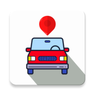
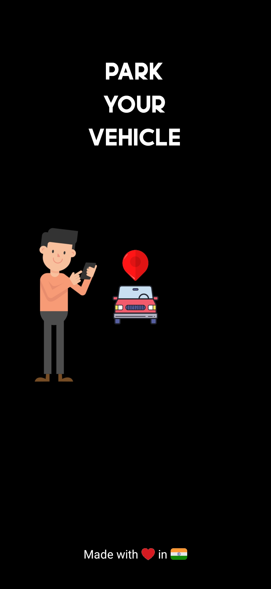
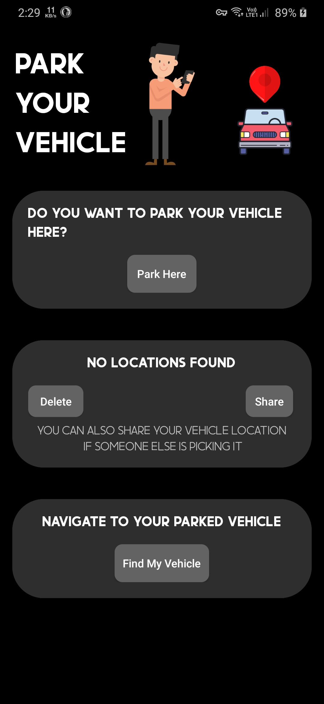

# **Park Your Vehicle**

An android app to find your parked vehicle location.

This app saves your parked car's location, helps you find it later, and lets you share the location with others. Simply save your location when you park and retrieve it later with the app's navigation feature. The app is fast, lightweight, and compatible with Android 5.0 (Lollipop) and up. 

Never lose your car again with this convenient app.

 

  

---

## Screenshots

|  |  | 
| :------------------------------------------------: | :-----------------------------------------------------: |
|                 Splash Screen                  |                    Home Screen                   |
